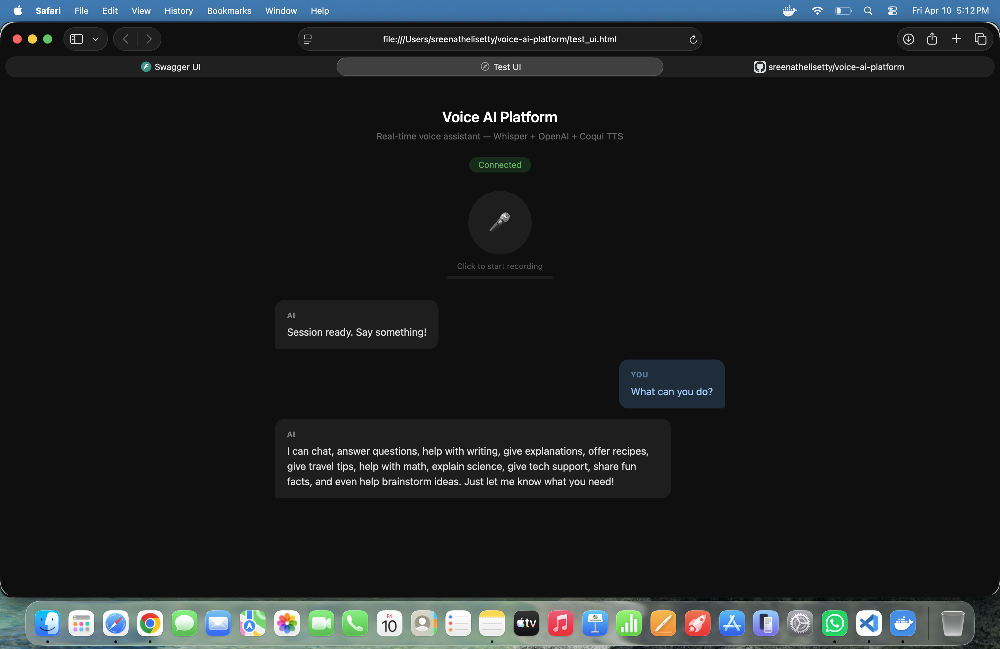
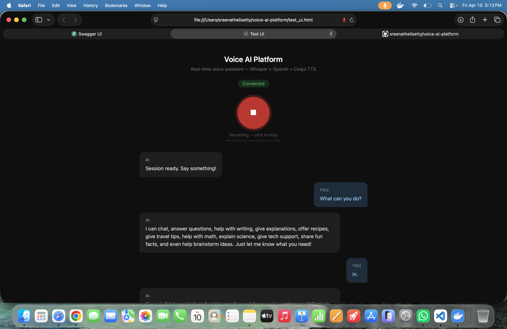
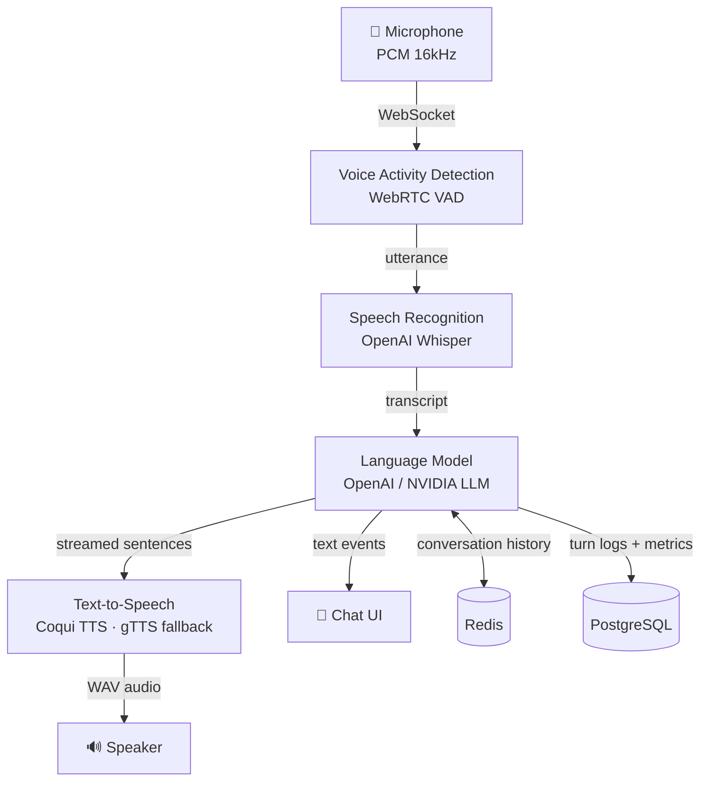

# Voice AI Platform

> A full-stack, real-time voice AI assistant platform designed for low-latency conversational experiences. The system streams raw PCM audio from clients over WebSocket, runs voice activity detection (WebRTC VAD) to segment speech into utterances, transcribes them using OpenAI Whisper, generates contextual responses by streaming from an LLM with conversation history, and synthesizes natural-sounding replies using Coqui TTS (with gTTS as a fallback) all delivered back to the client as WAV audio in real time.
>
> The backend is built with FastAPI and a fully asynchronous pipeline architecture where each stage (VAD, ASR, LLM, TTS) runs as an independent asyncio task communicating through bounded queues, providing natural back-pressure and graceful shutdown. Session state is managed in Redis with reconnect support, and full conversation turn history including per-turn latency metrics for ASR, LLM first-token, and TTS is persisted in PostgreSQL.
>
> The project includes a Docker Compose setup for one-command local deployment, a React Native mobile client, database migrations via Alembic, and an observability layer with structured logging. Designed to be extensible swap in any OpenAI-compatible LLM endpoint, change the Whisper model size, or plug in a different TTS engine with minimal configuration changes.

---

## Screenshots

| Idle | Recording |
|---|---|
|  |  |

---

## Architecture



---

## Stack

| Layer | Technology |
|---|---|
| API & WebSocket | FastAPI + Uvicorn |
| Speech Recognition | OpenAI Whisper (`small.en`) |
| Language Model | OpenAI / NVIDIA-compatible LLM |
| Text-to-Speech | Coqui TTS · gTTS fallback |
| Voice Activity Detection | WebRTC VAD |
| Session State | Redis |
| Conversation History | PostgreSQL + SQLAlchemy |
| Migrations | Alembic |
| Mobile Client | React Native |
| Deployment | Docker Compose |

---

## Quick Start

```bash
# Set your API key
export OPENAI_API_KEY=sk-...

# Start all services
cd infra
docker compose up --build
```

API docs available at `http://localhost:8000/docs`

---

## Pipeline

```
Microphone → WebSocket → VAD → Whisper ASR → LLM → Coqui TTS → WebSocket → Speaker
```

Each stage runs as an independent asyncio task with bounded queues between them. The pipeline processes one utterance at a time and streams TTS sentences back as they are synthesized, minimising end-to-end latency.
